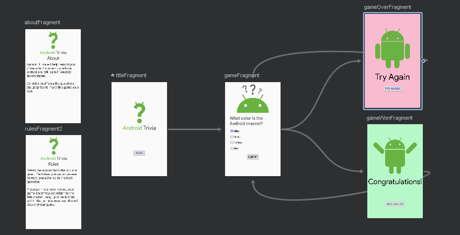
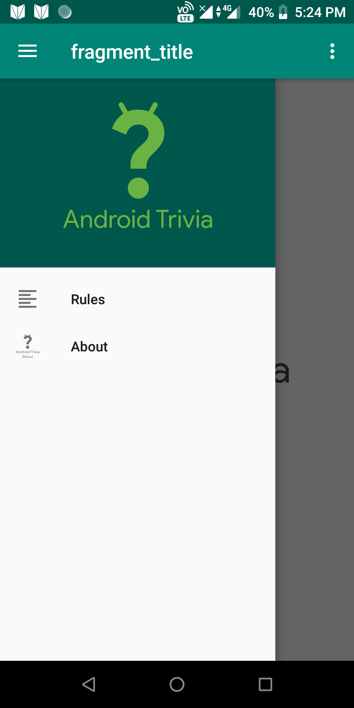
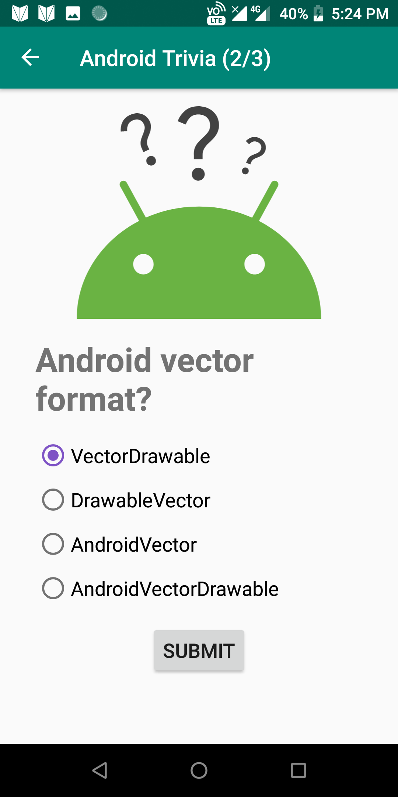
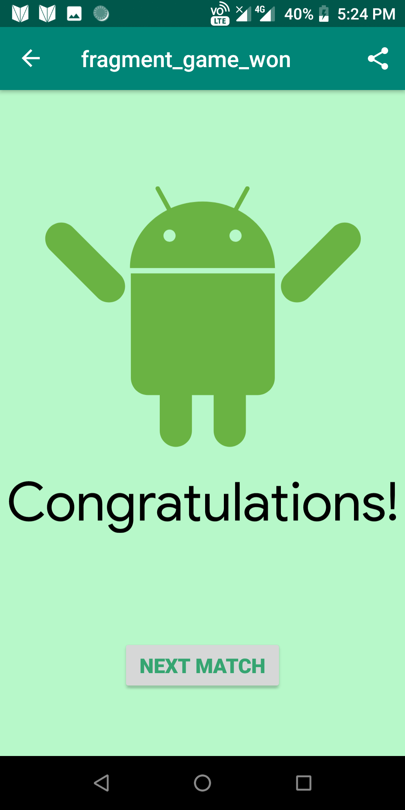

## Android Trivia 

The Android Trivia application is an application that asks the user trivia questions about Android development.  It makes use of the Navigation component within Jetpack to move the user between different screens.  Each screen is implemented as a Fragment.
The app navigates using buttons, the Action Bar, and the Navigation Drawer.
Since students haven't yet learned about saving data or the Android lifecycle, it tries to eliminate bugs caused by configuration changes. 

## Screenshots

